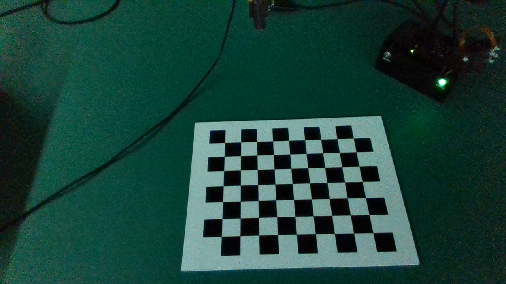
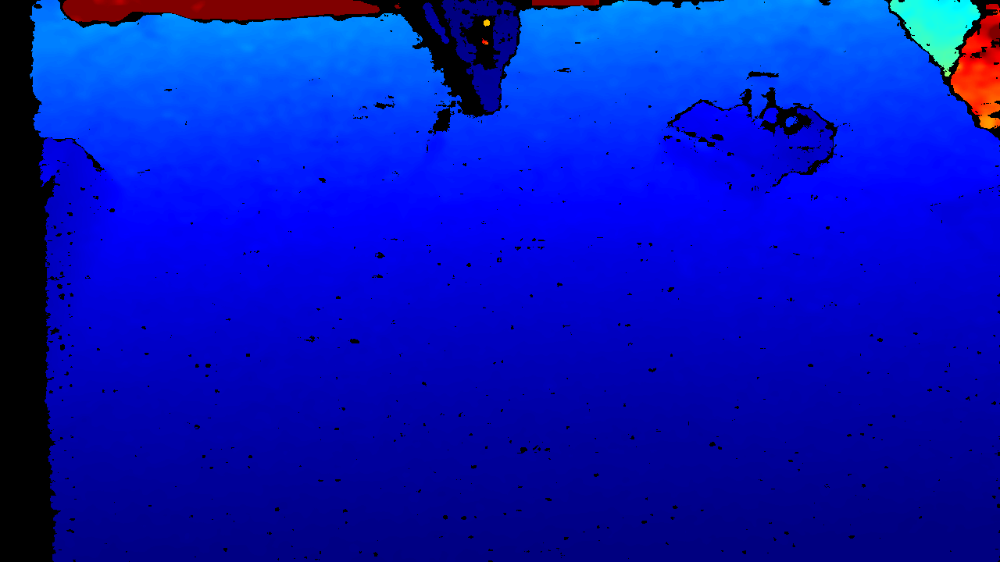
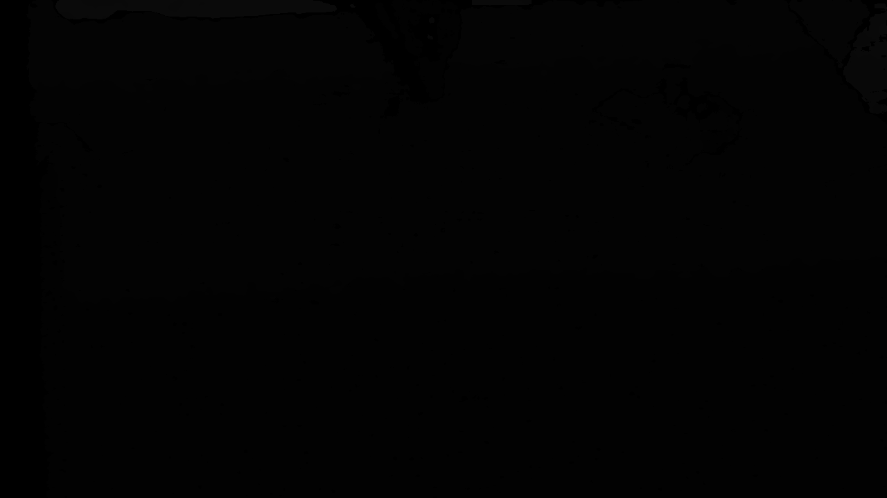

# 相机信息 — Intel RealSense D435

> 采集时间：2026-06-23 17:16:45  

## 基本信息

| 项目 | 值 |
| --- | --- |
| 设备名称 | Intel RealSense D435 |
| 序列号 (SN) | **261722076078** |
| 产品线 | D400 |
| 产品 ID | 0B07 |
| 固件版本 | 5.13.0.55 |
| ASIC 序列号 | 343223023797 |
| Advanced Mode | YES |
| 相机锁定 | YES |
| 连接类型 | `USB` |
| USB 描述符 | `3.2` |
| 物理端口 | `/sys/devices/pci0000:00/0000:00:14.0/usb2/2-1/2-1.1/2-1.1.1/2-1.1.1:1.0/video4linux/video0` |
| 固件升级 ID | `343223023797` |
| IMU 类型 | IMU_Unknown |
| 调试操作码 | `15` |

## 传感器与支持的流配置

### Stereo Module

| 流类型 | 格式 | 宽×高 | 可选帧率 (fps) |
| --- | --- | --- | --- |
| depth | z16 | 1280×720 | 6, 15, 30 |
| depth | z16 | 848×480 | 6, 15, 30, 60, 90 |
| depth | z16 | 848×100 | 100, 300 |
| depth | z16 | 640×480 | 6, 15, 30, 60, 90 |
| depth | z16 | 640×360 | 6, 15, 30, 60, 90 |
| depth | z16 | 480×270 | 6, 15, 30, 60, 90 |
| depth | z16 | 424×240 | 6, 15, 30, 60, 90 |
| depth | z16 | 256×144 | 90, 300 |
| infrared | y16 | 1280×800 | 15, 25 |
| infrared | y8 | 1280×800 | 15, 30 |
| infrared | y8 | 1280×720 | 6, 15, 30 |
| infrared | y8 | 848×480 | 6, 15, 30, 60, 90 |
| infrared | y8 | 848×100 | 100, 300 |
| infrared | y8 | 640×480 | 6, 15, 30, 60, 90 |
| infrared | y16 | 640×400 | 15, 25 |
| infrared | y8 | 640×360 | 6, 15, 30, 60, 90 |
| infrared | y8 | 480×270 | 6, 15, 30, 60, 90 |
| infrared | y8 | 424×240 | 6, 15, 30, 60, 90 |

### RGB Camera

| 流类型 | 格式 | 宽×高 | 可选帧率 (fps) |
| --- | --- | --- | --- |
| color | rgb8 | 1920×1080 | 6, 15, 30 |
| color | bgra8 | 1920×1080 | 6, 15, 30 |
| color | rgba8 | 1920×1080 | 6, 15, 30 |
| color | bgr8 | 1920×1080 | 6, 15, 30 |
| color | yuyv | 1920×1080 | 6, 15, 30 |
| color | rgb8 | 1280×720 | 6, 15, 30 |
| color | bgra8 | 1280×720 | 6, 15, 30 |
| color | rgba8 | 1280×720 | 6, 15, 30 |
| color | bgr8 | 1280×720 | 6, 15, 30 |
| color | yuyv | 1280×720 | 6, 15, 30 |
| color | rgb8 | 960×540 | 6, 15, 30, 60 |
| color | bgra8 | 960×540 | 6, 15, 30, 60 |
| color | rgba8 | 960×540 | 6, 15, 30, 60 |
| color | bgr8 | 960×540 | 6, 15, 30, 60 |
| color | yuyv | 960×540 | 6, 15, 30, 60 |
| color | rgb8 | 848×480 | 6, 15, 30, 60 |
| color | bgra8 | 848×480 | 6, 15, 30, 60 |
| color | rgba8 | 848×480 | 6, 15, 30, 60 |
| color | bgr8 | 848×480 | 6, 15, 30, 60 |
| color | yuyv | 848×480 | 6, 15, 30, 60 |
| color | rgb8 | 640×480 | 6, 15, 30, 60 |
| color | bgra8 | 640×480 | 6, 15, 30, 60 |
| color | rgba8 | 640×480 | 6, 15, 30, 60 |
| color | bgr8 | 640×480 | 6, 15, 30, 60 |
| color | yuyv | 640×480 | 6, 15, 30, 60 |
| color | rgb8 | 640×360 | 6, 15, 30, 60 |
| color | bgra8 | 640×360 | 6, 15, 30, 60 |
| color | rgba8 | 640×360 | 6, 15, 30, 60 |
| color | bgr8 | 640×360 | 6, 15, 30, 60 |
| color | yuyv | 640×360 | 6, 15, 30, 60 |
| color | rgb8 | 424×240 | 6, 15, 30, 60 |
| color | bgra8 | 424×240 | 6, 15, 30, 60 |
| color | rgba8 | 424×240 | 6, 15, 30, 60 |
| color | bgr8 | 424×240 | 6, 15, 30, 60 |
| color | yuyv | 424×240 | 6, 15, 30, 60 |
| color | rgb8 | 320×240 | 6, 30, 60 |
| color | bgra8 | 320×240 | 6, 30, 60 |
| color | rgba8 | 320×240 | 6, 30, 60 |
| color | bgr8 | 320×240 | 6, 30, 60 |
| color | yuyv | 320×240 | 6, 30, 60 |
| color | rgb8 | 320×180 | 6, 30, 60 |
| color | bgra8 | 320×180 | 6, 30, 60 |
| color | rgba8 | 320×180 | 6, 30, 60 |
| color | bgr8 | 320×180 | 6, 30, 60 |
| color | yuyv | 320×180 | 6, 30, 60 |

## 实时标定参数（本次采集分辨率）

### 彩色 (Color) 内参

- 分辨率：1280×720
- 焦距：fx=911.1559, fy=911.2447
- 主点：ppx=647.2494, ppy=372.3108
- 畸变模型：distortion.inverse_brown_conrady
- 畸变系数：[0.0, 0.0, 0.0, 0.0, 0.0]
- 视场角：HFOV≈70.17°，VFOV≈43.11°

### 深度 (Depth) 内参

- 分辨率：1280×720
- 焦距：fx=655.7533, fy=655.7533
- 主点：ppx=635.2955, ppy=355.7805
- 畸变模型：distortion.brown_conrady
- 畸变系数：[0.0, 0.0, 0.0, 0.0, 0.0]
- 视场角：HFOV≈88.61°，VFOV≈57.53°

- 深度单位 (depth_scale)：1.000000e-03 米/刻度（即 1000 刻度/米）

### 本次深度帧统计（有效像素）

- 最近距离：0.480 m
- 最远距离：2.687 m
- 平均距离：0.716 m
- 有效像素占比：92.9%

### 深度→彩色 外参

- 旋转矩阵 R（行优先）：
```
  +0.999986  -0.004419  +0.003018
  +0.004410  +0.999986  +0.002964
  -0.003031  -0.002951  +0.999991
```
- 平移向量 T：[+0.014984, +0.000103, +0.000398] (米)

## 采集的图像

### RGB 彩色图



### 深度图（彩色可视化）



### 深度图（原始 16-bit，数值=米/depth_scale）


